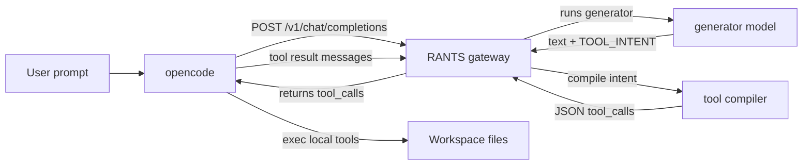

# Plan: Stabilize tool usage for opencode via RLM (rants_one_name)

## Goal
Make tool usage stable and predictable when opencode uses the `/v1/chat/completions` shim against the RLM model (`rants_one_name`). The generator should emit only user text + optional `TOOL_INTENT:`; the tool compiler should deterministically convert that intent into valid `tool_calls` that opencode can execute.

## Diagnosis (current behavior)
- `/v1/chat/completions` currently calls `Orchestrator.run_response(... execute_tools=False)` (`gateway/chat_shim.py:44`).
- In `Orchestrator.run_response`, `tool_calls` are only compiled when `output.tool_intent` is present (`gateway/orchestrator.py:74`).
- If the generator does not emit `TOOL_INTENT:`, no tool compilation happens, so the chat shim returns `finish_reason=stop` and no tool calls (`gateway/chat_shim.py:110`).

This is why opencode sometimes responds with a plain text suggestion (e.g., quoting `TOOL_INTENT` in Mermaid) instead of using tools to actually edit `README.md`.

## Strategy
1) Make it easier for the generator to decide to emit `TOOL_INTENT:` in editing/debugging tasks.
2) Make tool compilation robust when `TOOL_INTENT` exists (already partially improved).
3) Ensure chat completions returns tool calls in the *same turn* when tool usage is needed.

## Proposed changes (implementation steps)

### 1) Add tool-usage steering to generator system prompt
Update `RLMEngine._build_system_prompt()` (`gateway/rlm_engine.py:31`) to include:
- A short explicit instruction for when to use tools: when asked to modify files, run commands, inspect repo, etc.
- A strict rule that the generator must NOT output tool JSON or tool arguments.
- A strict rule that the generator must output `TOOL_INTENT:` when tools are required.

This increases the probability that the generator emits tool intent for prompts like “fix README.md Mermaid”.

### 2) Improve `_messages_to_input` to preserve tool context
Right now chat input is flattened into `role: ...` lines (`gateway/chat_shim.py:133`).
Enhance it to:
- Include the presence of tool definitions and tool_choice (briefly) so the generator knows tools exist.
- Keep it compact to avoid flooding context.

Example additional prefix:
- `available_tools: bash, read, edit, write, ...`
- `tool_choice: auto`

### 3) Ensure tool compiler is deterministic and JSON-only
Already implemented in `gateway/orchestrator.py`:
- Provide explicit JSON-only instructions.
- Add one repair attempt on invalid output.
- Parse JSON even if wrapped in code fences / extra text.

Optional follow-up (provider dependent): add stop sequences / JSON mode via `config.yaml` tool_compiler.parameters.

### 4) Add debug-gated raw output logging
Add logging for raw tool-compiler output when parsing fails.
- Use stdlib `logging`.
- Gate with an env var (e.g., `RANTS_DEBUG_TOOL_COMPILER=1`) so secrets/tool args aren’t logged by default.

### 5) Add a contract test that reproduces the Mermaid edit workflow
Add a Behave scenario that:
- Provides a user prompt that requests updating `README.md`.
- Stubs generator output to include `TOOL_INTENT:`.
- Stubs tool compiler output to return an `edit` call.
- Verifies `/v1/chat/completions` returns `finish_reason=tool_calls` with an `edit` tool call.

Optionally add a second scenario where generator output does NOT include `TOOL_INTENT:` and we verify no tool calls are returned (documenting expected behavior).

## Mermaid: control flow overview

## Open questions / decisions
1) Should the gateway ever *synthesize* a tool intent when the user asked to modify a file but the generator forgot `TOOL_INTENT:`?
   - Default: No (keeps RLM contract strict).
   - Alternative: add a heuristic fallback for common tasks (risk: surprise tool use).

2) Do you want `/v1/chat/completions` to support multi-turn tool calling (opencode loop), or only single-turn tool calls?
   - Current: single-turn tool calls (it returns tool_calls, opencode executes, then sends tool results).

## Acceptance criteria
- For file-edit prompts via opencode, generator reliably emits `TOOL_INTENT:`.
- Tool compiler reliably produces parseable JSON tool_calls.
- `/v1/chat/completions` responds with `finish_reason=tool_calls` when tool use is needed.
- No 502 from "unparseable tool_calls" under normal conditions.
